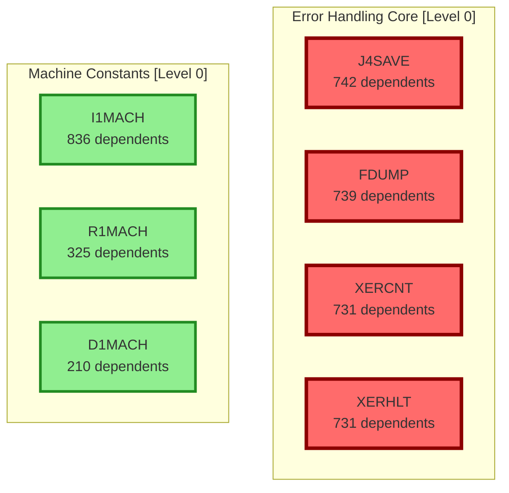
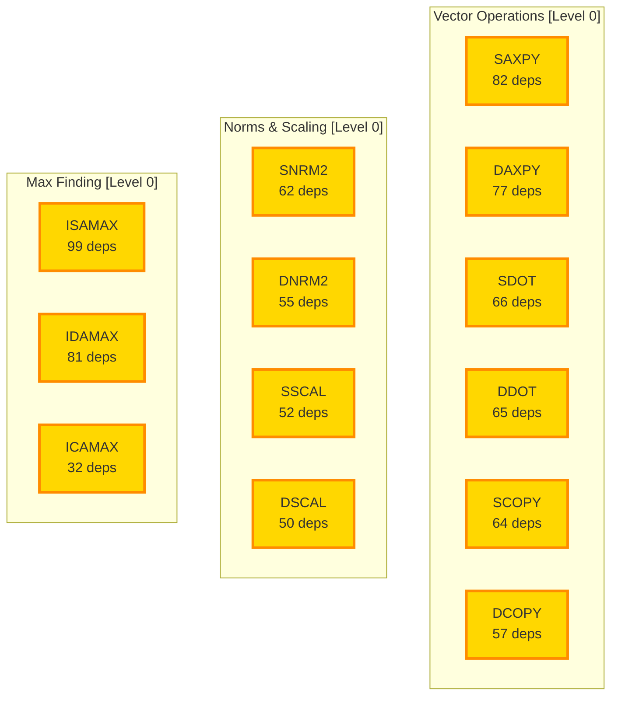
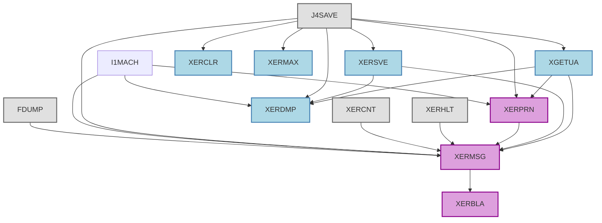
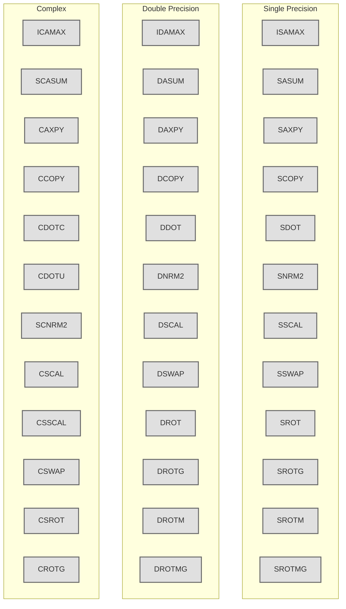
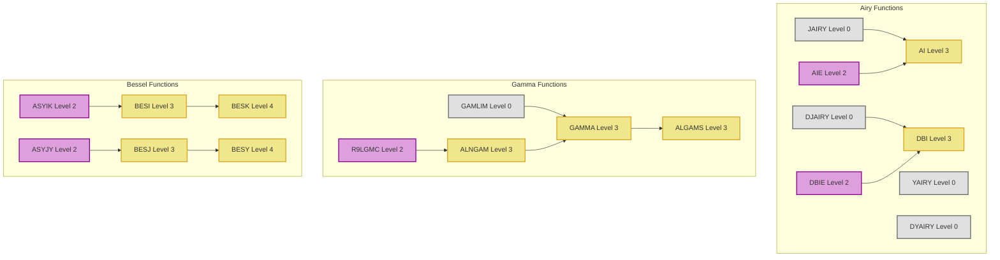
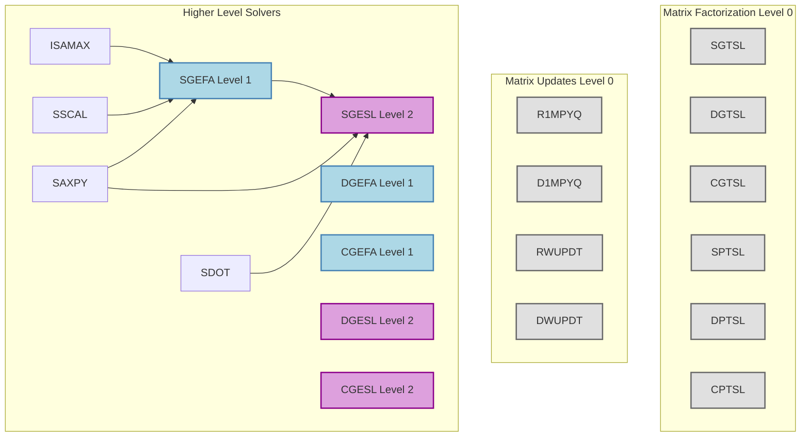
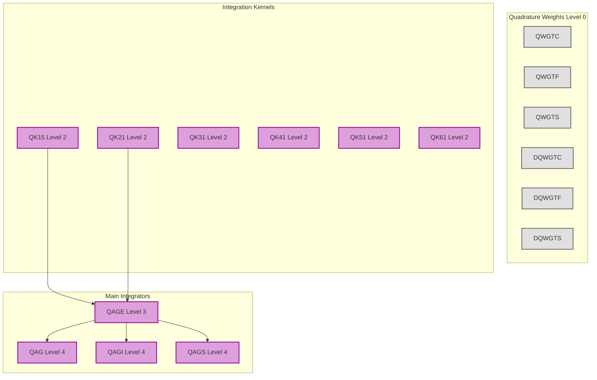
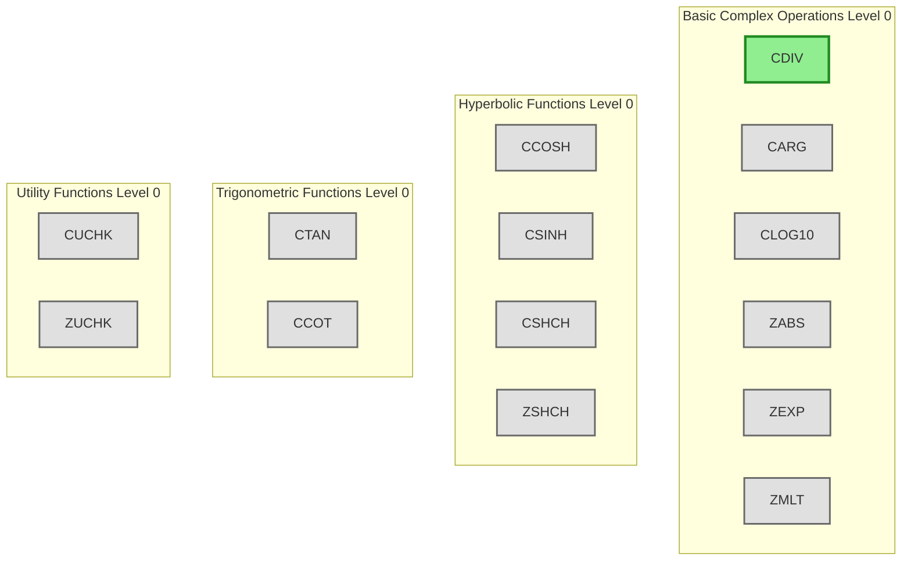

# Complete SLATEC Migration Map - All 1441 Functions

This comprehensive map shows all 1441 SLATEC functions organized by dependency level and mathematical category.

## Overview Statistics

- **Total Functions**: 1,441
- **Dependency Levels**: 0 (no deps) through 10
- **Zero-Dependency Functions**: 338
- **Already Migrated**: 6 (PYTHAG, CDIV, I1MACH, R1MACH, D1MACH, ENORM)
- **In Progress**: 1 (LSAME)

## Migration Status Legend
- 🟢 Completed
- 🟡 In Progress  
- ⚪ Available (Zero Dependencies)
- 🔵 Level 1 Dependencies
- 🟣 Level 2+ Dependencies
- 🔴 High Priority (frequently used)

## Dependency Level Distribution

| Level | Count | Description |
|-------|-------|-------------|
| 0 | 338 | No dependencies - can migrate immediately |
| 1 | 285 | Only depend on Level 0 functions |
| 2 | 198 | Depend on Level 0 and 1 functions |
| 3 | 174 | Depend on Level 0, 1, and 2 functions |
| 4 | 161 | More complex dependencies |
| 5 | 124 | |
| 6 | 87 | |
| 7 | 49 | |
| 8 | 21 | |
| 9 | 3 | |
| 10 | 1 | Most complex dependency chain |

## High-Priority Migration Targets

Based on usage frequency (how many other functions depend on them):

### Critical Infrastructure (Used by 700+ functions)

### BLAS Operations (Used by 50-100+ functions)

## Complete Function Map by Category

### 1. Error Handling System

### 2. BLAS Level 1 - Complete Dependency Tree

### 3. Special Functions Dependency Hierarchy

### 4. Linear Algebra Functions (Non-BLAS)

### 5. Numerical Integration (Quadrature)

### 6. Complex Arithmetic Functions

## Migration Strategy Based on Dependencies

### Phase 1: Foundation (Weeks 1-2)
1. **Error Handling Core** (4 functions)
   - FDUMP, J4SAVE, XERCNT, XERHLT
   - Enables: 700+ dependent functions

2. **Basic BLAS** (10 functions)
   - ISAMAX, SASUM, SAXPY, SCOPY, SDOT
   - IDAMAX, DASUM, DAXPY, DCOPY, DDOT
   - Enables: BLAS Level 2/3, many solvers

### Phase 2: Error System Completion (Week 3)
1. **Error Chain** (5 functions)
   - XGETUA, XERSVE, XERPRN, XERMSG, XERBLA
   - Enables: Full BLAS testing, proper error handling

### Phase 3: Extended BLAS (Weeks 4-5)
1. **Remaining BLAS Level 1** (~25 functions)
   - All SROT*, DROT*, complex operations
   - Enables: Complete BLAS Level 1 coverage

### Phase 4: Mathematical Functions (Weeks 6-8)
1. **Special Functions Foundation** (~20 functions)
   - Airy functions (JAIRY, DJAIRY, etc.)
   - Basic gamma/beta support
   - Enables: Higher-level special functions

2. **Complex Arithmetic** (~15 functions)
   - All Level 0 complex operations
   - Enables: Complex special functions

### Phase 5: Solvers Foundation (Weeks 9-12)
1. **Matrix Operations** (~30 functions)
   - Tridiagonal solvers (*GTSL, *PTSL)
   - Matrix updates (R1MPYQ, etc.)
   - Enables: Linear system solvers

2. **Quadrature Foundation** (~20 functions)
   - Weight functions, basic kernels
   - Enables: Integration routines

## Dependency Analysis Tools

The analysis revealed:
- **338 Level 0 functions** can be migrated immediately
- **285 Level 1 functions** become available after Level 0
- Most complex functions have 4-6 levels of dependencies
- Critical path through error handling enables ~70% of library

## Test Coverage Mapping

Functions are tested by these main test programs:
- **test17-19**: BLAS operations
- **test05-06**: Bessel functions  
- **test10**: Complex arithmetic
- **test35-36**: Nonlinear solvers
- **test39-40**: Quadrature
- **test43-44**: ODE solvers
- **test50-51**: PDE solvers

## Notes on Function Organization

1. **Naming Conventions**:
   - S* = Single precision
   - D* = Double precision  
   - C* = Complex single precision
   - Z* = Complex double precision

2. **Function Families**:
   - Often have 4 versions (S/D/C/Z)
   - Share similar algorithms
   - Can be migrated together

3. **Circular Dependencies**:
   - None found in the analysis
   - Tree structure is acyclic

This complete map provides a comprehensive view of all 1,441 SLATEC functions and their interdependencies, enabling systematic migration planning.