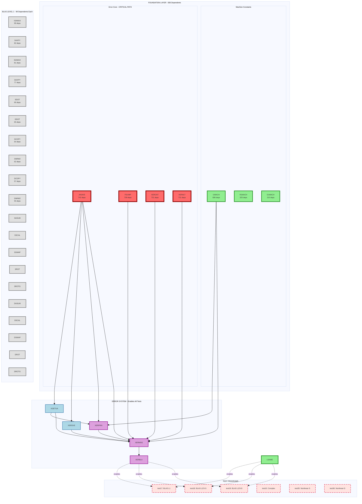
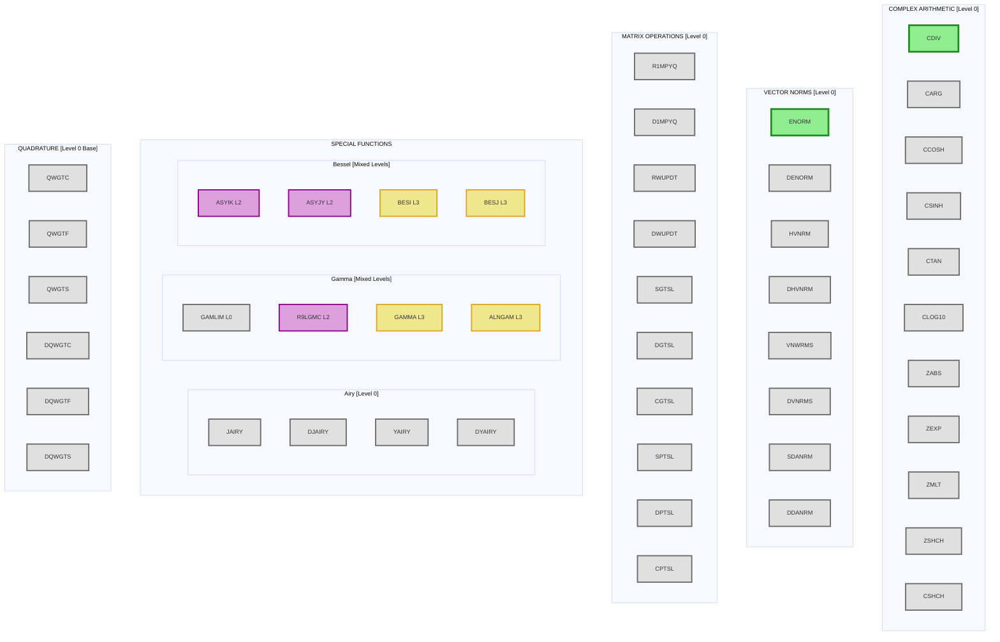

# SLATEC Migration Master Map - Print Edition

This consolidated map integrates all migration information into print-friendly diagrams that show all 1,441 functions while being readable on standard paper sizes.

## Executive Summary

- **Total Functions**: 1,441
- **Completed**: 7 (PYTHAG, CDIV, I1MACH, R1MACH, D1MACH, ENORM, LSAME)
- **Zero Dependencies**: 338 (can migrate immediately)
- **Critical Path**: Error handling core (4 functions) enables 700+ dependents

## Master Dependency Flow (Page 1 of 2)



## Master Dependency Flow (Page 2 of 2)



## Complete Function Inventory by Category

### Zero-Dependency Functions (338 total) - Can Migrate Now

| Category | Count | Key Functions | Priority |
|----------|-------|---------------|----------|
| **Error Core** | 4 | FDUMP, J4SAVE, XERCNT, XERHLT | 🔴 CRITICAL |
| **BLAS Level 1** | 38 | ISAMAX, SAXPY, SDOT, DAXPY, DDOT | 🔴 HIGH |
| **Complex Arithmetic** | 15 | CARG, CCOSH, ZABS, ZEXP, ZMLT | 🟡 MEDIUM |
| **Vector Norms** | 12 | DENORM, HVNRM, VNWRMS, SDANRM | 🟡 MEDIUM |
| **Matrix Direct Solvers** | 6 | SGTSL, DGTSL, SPTSL, DPTSL | 🟡 MEDIUM |
| **Matrix Updates** | 4 | R1MPYQ, D1MPYQ, RWUPDT, DWUPDT | 🟡 MEDIUM |
| **Airy Functions** | 4 | JAIRY, DJAIRY, YAIRY, DYAIRY | 🟢 LOW |
| **Quadrature Weights** | 6 | QWGTC, QWGTF, QWGTS, DQW* | 🟢 LOW |
| **Utilities** | 249 | PIMACH, various helpers | 🟢 LOW |

### Level 1 Dependencies (285 total) - Available After Core

| Category | Count | Key Functions | Depends On |
|----------|-------|---------------|------------|
| **BLAS Level 2** | 24 | SGEMV, DGEMV, SGER, DGER | BLAS L1 + XERBLA |
| **LU Factorization** | 12 | SGEFA, DGEFA, CGEFA | BLAS L1 |
| **Error Handlers** | 5 | XGETUA, XERSVE, XERCLR | J4SAVE |
| **Special Functions** | 44 | Various gamma, beta helpers | Machine constants |
| **Linear Solvers** | 200 | Various specialized solvers | BLAS + Error |

### Dependency Chains Summary

```
Level 0 (338) → Level 1 (285) → Level 2 (198) → Level 3 (174) → Level 4 (161) → ... → Level 10 (1)
```

## Migration Execution Plan

### Week 1: Critical Foundation (8 functions)
```
Error Core (4): FDUMP, J4SAVE, XERCNT, XERHLT
BLAS Core (4): ISAMAX, SAXPY, IDAMAX, DAXPY
→ Enables: 700+ functions, basic testing
```

### Week 2: Error System + Extended BLAS (15 functions)
```
Error Chain (5): XGETUA, XERSVE, XERPRN, XERMSG, XERBLA
BLAS Extension (10): SDOT, DDOT, SCOPY, DCOPY, SNRM2, DNRM2, SSCAL, DSCAL, SASUM, DASUM
→ Enables: Full BLAS testing (test17-19)
```

### Week 3: Complex & Norms (20 functions)
```
Complex (10): ZABS, ZEXP, ZMLT, CARG, CCOSH, CSINH, CTAN, CLOG10, ZSHCH, CSHCH
Norms (10): DENORM, HVNRM, DHVNRM, VNWRMS, DVNRMS, SDANRM, DDANRM, etc.
→ Enables: Complex arithmetic tests (test10), ODE solvers
```

### Week 4: Matrix Operations (20 functions)
```
Direct Solvers (6): SGTSL, DGTSL, CGTSL, SPTSL, DPTSL, CPTSL
Matrix Updates (4): R1MPYQ, D1MPYQ, RWUPDT, DWUPDT
Remaining BLAS L1 (10): SROT, DROT, SSWAP, DSWAP, etc.
→ Enables: Nonlinear solver tests (test35-36)
```

### Weeks 5-8: Systematic Coverage
- Complete remaining BLAS Level 1 (18 functions)
- Special functions foundation (40 functions)
- Quadrature base functions (20 functions)
- Additional utilities as needed

## Test Coverage Matrix

| Test Program | Required Functions | Status |
|--------------|-------------------|--------|
| test17 (BLAS L1) | LSAME ✓, XERBLA, BLAS L1 functions | Partial |
| test18 (BLAS L2/3-S) | LSAME ✓, XERBLA, BLAS L2 | Blocked |
| test19 (BLAS L2/3-D) | LSAME ✓, XERBLA, BLAS L2 | Blocked |
| test10 (Complex) | CDIV ✓, ZABS, ZEXP, ZMLT | Partial |
| test35 (Nonlinear-S) | ENORM ✓, R1MPYQ, RWUPDT | Partial |
| test36 (Nonlinear-D) | DENORM, D1MPYQ, DWUPDT | Blocked |

## Function Naming Convention Reference

| Prefix | Type | Example |
|--------|------|---------|
| S* | Single precision real | SAXPY |
| D* | Double precision real | DAXPY |
| C* | Single precision complex | CAXPY |
| Z* | Double precision complex | ZAXPY |
| I* | Integer operation | ISAMAX |
| R* | Real utility | R1MACH |
| X* | Error handling | XERMSG |

## Key Migration Insights

1. **Critical Path**: Error handling core (4 functions) → Error chain (5 functions) → XERBLA enables most testing
2. **High ROI**: First 20 functions enable 700+ dependents and 3 major test suites
3. **Parallel Work**: After error core, BLAS/Complex/Norms can be done in parallel
4. **Test-Driven**: Each phase enables specific test programs for validation
5. **No Circular Dependencies**: Clean acyclic dependency graph throughout

## Notes for Implementation

- Functions in same family (S*/D*/C*/Z* variants) share algorithms - migrate together
- Level 0 functions have no dependencies - can be migrated in any order within priority
- Use completed functions as templates for similar ones
- Run relevant test programs after each phase to validate migrations

---
*This document consolidates MIGRATION_MAP.md, COMPLETE_MIGRATION_MAP.md, and MIGRATION_GUIDE.md into a unified, print-optimized reference.*