# SLATEC Migration Map with Dependencies and Test Groups

This comprehensive map shows all zero-dependency functions, their relationships, and which test programs validate them.

## Migration Status Legend
- 🟢 Completed
- 🟡 In Progress  
- ⚪ Available (Zero Dependencies)
- 🔵 Requires Dependencies

## Full Migration Dependency Graph

```mermaid
graph TB
    %% Define styles
    classDef completed fill:#90EE90,stroke:#228B22,stroke-width:3px
    classDef inProgress fill:#FFD700,stroke:#FFA500,stroke-width:3px
    classDef available fill:#E0E0E0,stroke:#696969,stroke-width:2px
    classDef dependent fill:#ADD8E6,stroke:#4682B4,stroke-width:2px
    classDef testGroup fill:#FFE4E1,stroke:#DC143C,stroke-width:2px,stroke-dasharray: 5 5

    %% Completed Functions
    PYTHAG[PYTHAG]:::completed
    CDIV[CDIV]:::completed
    I1MACH[I1MACH]:::completed
    R1MACH[R1MACH]:::completed
    D1MACH[D1MACH]:::completed
    ENORM[ENORM]:::completed

    %% In Progress
    LSAME[LSAME]:::inProgress

    %% Test Program Groups
    subgraph "Test Groups"
        TEST17["test17: BLAS Level 1"]:::testGroup
        TEST18["test18: BLAS Level 2/3 (Single)"]:::testGroup
        TEST19["test19: BLAS Level 2/3 (Double)"]:::testGroup
        TEST10["test10: Complex Arithmetic"]:::testGroup
        TEST35["test35: Nonlinear Solvers (Single)"]:::testGroup
        TEST36["test36: Nonlinear Solvers (Double)"]:::testGroup
        TEST05["test05: Bessel Functions (Single)"]:::testGroup
        TEST06["test06: Bessel Functions (Double)"]:::testGroup
    end

    %% Error Handling Core (Zero Dependencies)
    subgraph "Error Handling Foundation"
        FDUMP[FDUMP]:::available
        J4SAVE[J4SAVE]:::available
        XERCNT[XERCNT]:::available
        XERHLT[XERHLT]:::available
    end

    %% Error Handling Chain (With Dependencies)
    subgraph "Error Handling Chain"
        XGETUA[XGETUA]:::dependent
        XERSVE[XERSVE]:::dependent
        XERPRN[XERPRN]:::dependent
        XERMSG[XERMSG]:::dependent
        XERBLA[XERBLA]:::dependent
        
        J4SAVE --> XGETUA
        J4SAVE --> XERSVE
        J4SAVE --> XERPRN
        I1MACH --> XERPRN
        XGETUA --> XERPRN
        
        FDUMP --> XERMSG
        I1MACH --> XERMSG
        J4SAVE --> XERMSG
        XERCNT --> XERMSG
        XERHLT --> XERMSG
        XERPRN --> XERMSG
        XERSVE --> XERMSG
        XGETUA --> XERMSG
        
        XERMSG --> XERBLA
    end

    %% BLAS Level 1 Functions (Zero Dependencies)
    subgraph "BLAS Level 1 - Zero Dependencies"
        %% Single Precision
        ISAMAX[ISAMAX]:::available
        SASUM[SASUM]:::available
        SAXPY[SAXPY]:::available
        SCOPY[SCOPY]:::available
        SDOT[SDOT]:::available
        SNRM2[SNRM2]:::available
        SSCAL[SSCAL]:::available
        SSWAP[SSWAP]:::available
        SROT[SROT]:::available
        SROTG[SROTG]:::available
        
        %% Double Precision
        IDAMAX[IDAMAX]:::available
        DASUM[DASUM]:::available
        DAXPY[DAXPY]:::available
        DCOPY[DCOPY]:::available
        DDOT[DDOT]:::available
        DNRM2[DNRM2]:::available
        DSCAL[DSCAL]:::available
        DSWAP[DSWAP]:::available
        DROT[DROT]:::available
        DROTG[DROTG]:::available
        
        %% Complex
        ICAMAX[ICAMAX]:::available
        SCASUM[SCASUM]:::available
        CAXPY[CAXPY]:::available
        CCOPY[CCOPY]:::available
        CDOTC[CDOTC]:::available
        CDOTU[CDOTU]:::available
        SCNRM2[SCNRM2]:::available
        CSCAL[CSCAL]:::available
        CSSCAL[CSSCAL]:::available
        CSWAP[CSWAP]:::available
        CSROT[CSROT]:::available
        CROTG[CROTG]:::available
    end

    %% Complex Arithmetic (Zero Dependencies)
    subgraph "Complex Arithmetic - Zero Dependencies"
        CARG[CARG]:::available
        CCOSH[CCOSH]:::available
        CSINH[CSINH]:::available
        CTAN[CTAN]:::available
        CLOG10[CLOG10]:::available
        ZABS[ZABS]:::available
        ZEXP[ZEXP]:::available
        ZMLT[ZMLT]:::available
        ZSHCH[ZSHCH]:::available
        CSHCH[CSHCH]:::available
    end

    %% Machine Constants and Utilities
    subgraph "Utilities - Zero Dependencies"
        PIMACH[PIMACH]:::available
        R1MPYQ[R1MPYQ]:::available
        D1MPYQ[D1MPYQ]:::available
        RWUPDT[RWUPDT]:::available
        DWUPDT[DWUPDT]:::available
    end

    %% Norms (Zero Dependencies)
    subgraph "Norms - Zero Dependencies"
        DENORM[DENORM]:::available
        HVNRM[HVNRM]:::available
        DHVNRM[DHVNRM]:::available
        VNWRMS[VNWRMS]:::available
        DVNRMS[DVNRMS]:::available
        SDANRM[SDANRM]:::available
        DDANRM[DDANRM]:::available
    end

    %% Special Functions (Zero Dependencies)
    subgraph "Special Functions - Zero Dependencies"
        JAIRY[JAIRY]:::available
        DJAIRY[DJAIRY]:::available
        YAIRY[YAIRY]:::available
        DYAIRY[DYAIRY]:::available
    end

    %% Test Dependencies
    TEST17 --> LSAME
    TEST17 --> ISAMAX
    TEST17 --> SASUM
    TEST17 --> SAXPY
    TEST17 --> SCOPY
    TEST17 --> SDOT
    TEST17 --> SNRM2
    TEST17 --> SSCAL
    TEST17 --> XERBLA

    TEST18 --> LSAME
    TEST18 --> XERBLA
    
    TEST19 --> LSAME
    TEST19 --> XERBLA

    TEST10 --> CDIV
    TEST10 --> ZABS
    TEST10 --> ZEXP
    TEST10 --> ZMLT

    TEST35 --> ENORM
    TEST35 --> R1MPYQ
    TEST35 --> RWUPDT

    TEST36 --> DENORM
    TEST36 --> D1MPYQ
    TEST36 --> DWUPDT

    %% Show which functions enable tests
    XERBLA -.->|enables| TEST17
    XERBLA -.->|enables| TEST18
    XERBLA -.->|enables| TEST19
```

## Migration Priority Based on Test Enablement

### Phase 1: Enable BLAS Tests (test17, test18, test19)
1. **Complete LSAME** (in progress) - Required by all BLAS Level 2/3
2. **Error Handling Core**:
   - FDUMP ⚪
   - J4SAVE ⚪
   - XERCNT ⚪
   - XERHLT ⚪
3. **Error Handling Chain** (to get XERBLA):
   - XGETUA 🔵
   - XERSVE 🔵
   - XERPRN 🔵
   - XERMSG 🔵
   - XERBLA 🔵
4. **BLAS Level 1 Functions** (pick 5-10):
   - ISAMAX ⚪
   - SASUM ⚪
   - SAXPY ⚪
   - SCOPY ⚪
   - SDOT ⚪

### Phase 2: Enable Complex Arithmetic Tests (test10)
Already partially enabled with:
- CDIV 🟢
- Need to add:
  - ZABS ⚪
  - ZEXP ⚪
  - ZMLT ⚪
  - CARG ⚪
  - CCOSH ⚪

### Phase 3: Enable Nonlinear Solver Tests (test35, test36)
Already partially enabled with:
- ENORM 🟢
- Need to add:
  - R1MPYQ ⚪
  - RWUPDT ⚪
  - DENORM ⚪
  - D1MPYQ ⚪
  - DWUPDT ⚪

## Zero-Dependency Functions by Category

### BLAS Functions (38 total)
**Single Precision**: ISAMAX, SASUM, SAXPY, SCOPY, SDOT, SNRM2, SSCAL, SSWAP, SROT, SROTG, SROTM, SROTMG
**Double Precision**: IDAMAX, DASUM, DAXPY, DCOPY, DDOT, DNRM2, DSCAL, DSWAP, DROT, DROTG, DROTM, DROTMG
**Complex**: ICAMAX, SCASUM, CAXPY, CCOPY, CDOTC, CDOTU, SCNRM2, CSCAL, CSSCAL, CSWAP, CSROT, CROTG

### Complex Arithmetic (15 total)
CARG, CCOSH, CSINH, CTAN, CLOG10, CDIV ✓, ZABS, ZEXP, ZMLT, ZSHCH, CSHCH, CUCHK, ZUCHK

### Norms (12 total)
ENORM ✓, DENORM, HVNRM, DHVNRM, VNWRMS, DVNRMS, SDANRM, DDANRM, SDNRM2, DDNRM2, SCNRM2, DZNRM2

### Machine Constants (5 total)
I1MACH ✓, R1MACH ✓, D1MACH ✓, PIMACH, J4SAVE

### Error Handling (4 total)
FDUMP, J4SAVE, XERCNT, XERHLT

### Special Functions - Airy (4 total)
JAIRY, DJAIRY, YAIRY, DYAIRY

### Matrix Updates (4 total)
R1MPYQ, D1MPYQ, RWUPDT, DWUPDT

### Total Zero-Dependency Functions: 338
- Completed: 6
- In Progress: 1
- Available: 331

## Key Insights

1. **Quick Win**: Migrating just 10 functions (error handling core + a few BLAS) enables running original BLAS tests
2. **Test Coverage**: Most zero-dependency functions are tested by the SLATEC test suite
3. **Dependencies Matter**: The error handling chain (XERBLA) is critical for many tests
4. **Parallel Work**: Many categories can be worked on independently (BLAS, complex arithmetic, norms)

## Recommended Migration Order

1. **Week 1**: LSAME + Error Core (FDUMP, J4SAVE, XERCNT, XERHLT)
2. **Week 2**: Error Chain (to get XERBLA) + 5 BLAS functions
3. **Week 3**: Complex arithmetic functions for test10
4. **Week 4**: Matrix update functions for test35/36
5. **Ongoing**: Fill in remaining BLAS and utility functions

This approach maximizes test coverage early and provides continuous validation throughout the migration process.