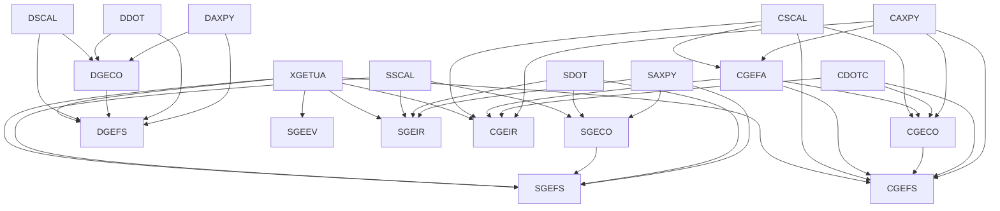
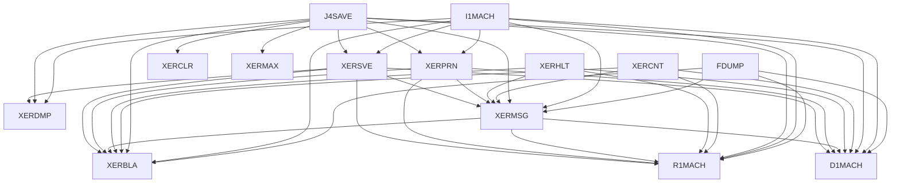
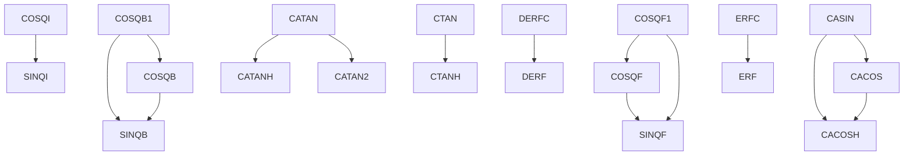

# Linear Algebra Functions

```mermaid
graph TD
    %% Level 0
    CAXPY
    CDOTC
    CSCAL
    DAXPY
    DDOT
    DSCAL
    SAXPY
    SDOT
    SSCAL
    %% Level 1
    CGEFA
    XGETUA
    %% Level 2
    CGECO
    DGECO
    SGECO
    %% Level 4
    DGEFS
    SGEEV
    SGEFS
    SGEIR
    %% Level 5
    CGEFS
    CGEIR
    %% Dependencies
    SAXPY --> SGEFS
    SDOT --> SGEFS
    SGECO --> SGEFS
    SSCAL --> SGEFS
    XGETUA --> SGEFS
    XGETUA --> SGEEV
    SAXPY --> SGECO
    SDOT --> SGECO
    SSCAL --> SGECO
    CAXPY --> CGEFS
    CDOTC --> CGEFS
    CGECO --> CGEFS
    CGEFA --> CGEFS
    CSCAL --> CGEFS
    XGETUA --> CGEFS
    CAXPY --> CGEIR
    CDOTC --> CGEIR
    CGEFA --> CGEIR
    CSCAL --> CGEIR
    XGETUA --> CGEIR
    CAXPY --> CGEFA
    CSCAL --> CGEFA
    CAXPY --> CGECO
    CDOTC --> CGECO
    CGEFA --> CGECO
    CSCAL --> CGECO
    DAXPY --> DGEFS
    DDOT --> DGEFS
    DGECO --> DGEFS
    DSCAL --> DGEFS
    XGETUA --> DGEFS
    DAXPY --> DGECO
    DDOT --> DGECO
    DSCAL --> DGECO
    SAXPY --> SGEIR
    SDOT --> SGEIR
    SSCAL --> SGEIR
    XGETUA --> SGEIR
```

# Utility Functions

```mermaid
graph TD
    %% Level 0
    FDUMP
    I1MACH
    J4SAVE
    XERCNT
    XERHLT
    %% Level 1
    XERCLR
    XERMAX
    %% Level 2
    XERPRN
    XERSVE
    %% Level 3
    XERDMP
    XERMSG
    %% Level 4
    D1MACH
    R1MACH
    XERBLA
    %% Dependencies
    FDUMP --> XERBLA
    I1MACH --> XERBLA
    J4SAVE --> XERBLA
    XERCNT --> XERBLA
    XERHLT --> XERBLA
    XERMSG --> XERBLA
    XERPRN --> XERBLA
    XERSVE --> XERBLA
    FDUMP --> R1MACH
    I1MACH --> R1MACH
    J4SAVE --> R1MACH
    XERCNT --> R1MACH
    XERHLT --> R1MACH
    XERMSG --> R1MACH
    XERPRN --> R1MACH
    XERSVE --> R1MACH
    J4SAVE --> XERMAX
    I1MACH --> XERSVE
    J4SAVE --> XERSVE
    I1MACH --> XERDMP
    J4SAVE --> XERDMP
    XERSVE --> XERDMP
    FDUMP --> D1MACH
    I1MACH --> D1MACH
    J4SAVE --> D1MACH
    XERCNT --> D1MACH
    XERHLT --> D1MACH
    XERMSG --> D1MACH
    XERPRN --> D1MACH
    XERSVE --> D1MACH
    FDUMP --> XERMSG
    I1MACH --> XERMSG
    J4SAVE --> XERMSG
    XERCNT --> XERMSG
    XERHLT --> XERMSG
    XERPRN --> XERMSG
    XERSVE --> XERMSG
    J4SAVE --> XERCLR
    I1MACH --> XERPRN
    J4SAVE --> XERPRN
```

# Special Functions

```mermaid
graph TD
    %% Level 2
    COSQI
    SINQI
    %% Level 3
    COSQB1
    COSQF1
    %% Level 4
    COSQB
    COSQF
    SINQB
    SINQF
    %% Level 5
    CASIN
    CATAN
    CATAN2
    CATANH
    CTAN
    CTANH
    DERFC
    ERFC
    %% Level 6
    CACOS
    CACOSH
    DERF
    ERF
    %% Dependencies
    CATAN --> CATANH
    COSQF1 --> COSQF
    CACOS --> CACOSH
    CASIN --> CACOSH
    COSQF --> SINQF
    COSQF1 --> SINQF
    CTAN --> CTANH
    CASIN --> CACOS
    DERFC --> DERF
    COSQB --> SINQB
    COSQB1 --> SINQB
    CATAN --> CATAN2
    COSQI --> SINQI
    ERFC --> ERF
    COSQB1 --> COSQB
```

